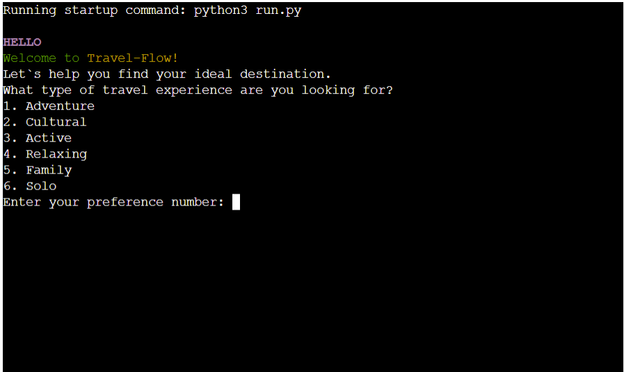

# Travel Flow

## Project Overview:
Travel-Flow is designed to assist users in finding their ideal travel destination based on their preferences. The project aims to simplify the process of choosing a travel experience by providing options for adventure, cultural exploration, active pursuits, relaxing getaways, family-friendly destinations, and solo adventures. The destination data is sourced from a spreadsheet, offering a diverse range of countries for each travel preference.

## Target Audience:
This project is tailored for individuals seeking personalized travel recommendations. Whether users are adventure enthusiasts, cultural explorers, active travelers, relaxation seekers, family vacation planners, or solo adventurers, Travel-Flow aims to cater to a broad audience with diverse travel preferences.

## Key Features:
- User-Friendly Interface: 
  
  The project provides a simple and user-friendly interface, ensuring that users can easily navigate through the different travel preferences.

  

- Wide Range of Destinations:

  Travel-Flow sources destination data from a spreadsheet, offering an extensive list of countries for each travel preference. This ensures a comprehensive and varied selection for users.

  

- Dynamic Preference Selection: 

  Users can choose from various travel preferences, including adventure, cultural exploration, active pursuits, relaxing getaways, family-friendly destinations, and solo adventures.

  

- Country Validation: 

  The project validates user input to ensure that selected countries align with the user's chosen travel preference, providing a seamless and error-free experience.

  

- Restart Option:

  Users have the option to restart the selection process, providing flexibility in exploring different travel preferences without restarting the entire program.

  

## Logical Chart

## Additional Features to Implement

- Activity Recommendations:

    Upon selecting a destination, provide a list of recommended activities or attractions in that country.

- Local Cuisine Suggestions:

    Integrate with a food database to recommend popular local dishes and restaurants in the chosen destination.
    Consider dietary preferences and restrictions if provided by the user.

- Historical and Cultural Insights:

    Provide brief historical and cultural insights about the selected destination.
    Share interesting facts, historical landmarks, and cultural events.

- Transportation Options:

    Offer information on transportation options within the chosen destination, such as public transit, car rentals, and ride-sharing services.
    Include estimated costs and travel times.

- Weather Forecast:

    Offer a more detailed forecast, including daily and weekly predictions.
    Include information on typical weather patterns during the chosen travel dates.

## Solved Bugs

1. Undefined Variable Error:

    - Issue: Reference to adventure_countries and explorer_countries variables before their assignment.
    - Resolution: Defined and assigned values to these variables before referencing them.

2. Input Validation for User Preferences:

    - Issue: Lack of input validation for user preferences, potentially allowing non-numeric inputs.
    - Resolution: Added input validation to ensure the user enters a valid numeric choice.

3. Function Parameter Mismatch:

    - Issue: Mismatch in function parameters when calling display_countries_for_adventure without passing the user_preference parameter.
    - Resolution: Adjusted function calls to pass the correct parameters.

4. Indentation Error:

    - Issue: Incorrect indentation in the restart function.
    - Resolution: Fixed the indentation to resolve the syntax error.

5. Loop Break Location:

    - Issue: The loop break statement was incorrectly placed in the display_countries_for_adventure function.
    - Resolution: Moved the loop break statement to the correct location to exit the loop after a valid country is chosen.

6. Incorrect Column Index:

    - Issue: Incorrect column index used when retrieving countries for display_countries_for_adventure.
    - Resolution: Corrected the column index to retrieve the desired countries.

7. Unused Variable:

    - Issue: Unused variable user_preference in the get_user_adventure_preference function.
    - Resolution: Removed the unused variable to improve code readability.

## Technologies Used

- Python - Language To build the application
- Google Sheets - To store the countries
- Google Cloud - To access the data in Google Sheets
- Lucidchart - To make the flowchart
- Chrome extension Screen Recorder - To screen recorder the gif for README
- Ezgif.com - To convert the video to gif
- Heroku - Used to deploy the project
- Python - Modules
    - sys - to add the exit option
    - gspread - API
    - google-auth - authentication mechanisms to access Google APIs

## Deployment

Before deploying to Heroku:

- Add list of dependencies to the requirements.txt file
   - To create list use this command in terminal: "pip3 freeze > requirements.txt" and the list will be added.
   - Commit and push

In Heroku

- In dashboard Click 'Create new app'
- Name app and choose region, click create
- Go to settings then to config vars
    - Click on 'Reveal config vars'
        - Key: CREDS Values: copy your creds.json file and paste it
        - Then Add
        - Add another one, Key: PORT Values: 8000
- Click on 'Add buildpack'
    - Select python and save changes
    - Add one more select nodejs and save again
    - Make sure python comes first
- Go to deploy and select github and confirm
- Search for repository
- Click on connect
- Select a deployment method
- Deploy!

## Testing

### Code Validator

- The code was run through the pep8 validator, any warnings or errors were fixed till it passed without any.

### Manual Testing

| Testing                                                     | Action                                          | Expected                                            | Result |
|-------------------------------------------------------------|--------------------------------------------------|------------------------------------------------------|--------|
| User chooses Adventure                                      | Choose Adventure                               | Display Adventure options (1. Adventure, 2. Explorer)| PASS   |
| - Selects preference 1                                      | - Input 1                                       | Display top 10 countries for Adventurers               | PASS   |
|                                                             |                                                  |                                                      |        |
| - Selects preference 2                                      | - Input 2                                       | Display top 10 countries for Explorers                | PASS   |
|                                                             |                                                  |                                                      |        |
| User chooses Cultural                                       | Choose Cultural                                | Display Cultural options (1. In-depth Cultural, 2. Food & Culinary)| PASS   |
| - Selects preference 1                                      | - Input 1                                       | Display top 10 countries for In-depth Cultural        | PASS   |
|                                                             |                                                  |                                                      |        |
| - Selects preference 2                                      | - Input 2                                       | Display top 10 countries for Food & Culinary          | PASS   |
|                                                             |                                                  |                                                      |        |
| User chooses Active                                         | Choose Active                                  | Display Active options (1. Hiking and Trekking, 2. Skiing)| PASS   |
| - Selects preference 1                                      | - Input 1                                       | Display top 10 countries for Hiking and Trekking      | PASS   |
|                                                             |                                                  |                                                      |        |
| - Selects preference 2                                      | - Input 2                                       | Display top 10 countries for Skiing                   | PASS   |
|                                                             |                                                  |                                                      |        |
| User chooses Relaxing                                       | Choose Relaxing                                | Display countries for Health, Spa & Wellbeing          | PASS   |
|                                                             |                                                  |                                                      |        |
| User chooses Family                                         | Choose Family                                  | Display countries families prefer to visit            | PASS   |
|                                                             |                                                  |                                                      |        |
| User chooses Solo                                           | Choose Solo                                    | Display most popular countries for solo travelers    | PASS   |
|                                                             |                                                  |                                                      |        |
| User enters an invalid option during country selection       | Enter an invalid country name                   | Prompt user to choose a country from the list         | PASS   |
|                                                             |                                                  |                                                      |        |
| User decides to restart the program after country selection | Choose 'yes' to restart                         | Restart the program with a new set of preferences    | PASS   |
|                                                             |                                                  |                                                      |        |
| User decides to exit the program                              | Choose 'no' to exit                             | Display a farewell message and exit the program      | PASS   |

## Credits

The main guidance and instructions in this project were from [Code Institute](https://codeinstitute.net)

- LMS - Love Sandwiches - help and navigation

Additional tutorial help from: https://docs.python.org/3/tutorial/

## Acknowledgement

- I would like to thank my amazing mentor Daisy for all her support, understanding, advice and for explaining things to me when I did not understand.
